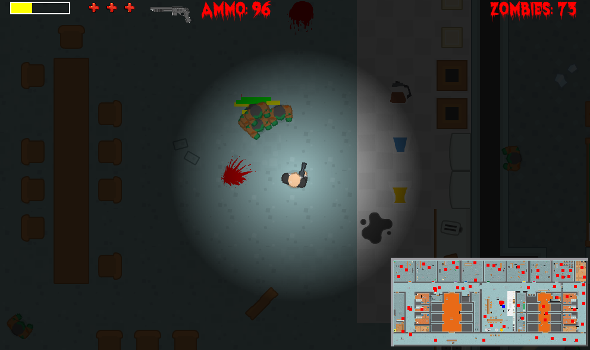
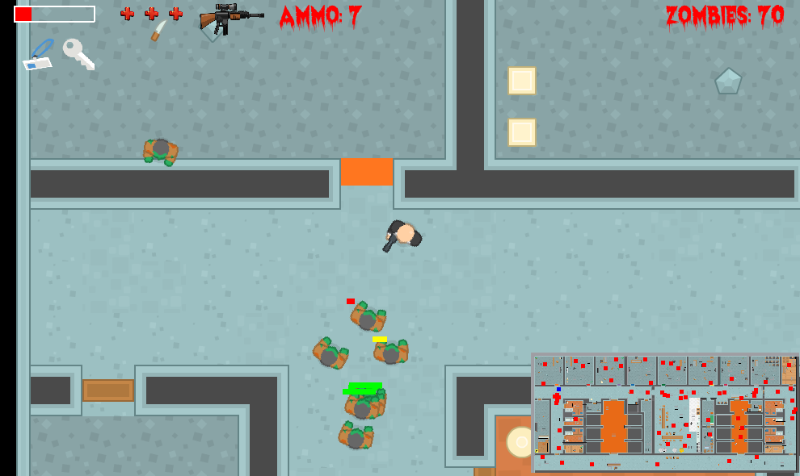

# Zombie game
Simple game created in pygame lib shows zombie attack on one of corporation floor called 'clab'. Main character has access to weapons like pistol, shotgun, rifle or Uzi and some bonuses. Game ends when player kills all zombies. 

## How to run
Create virtualenv and install all requirements and run command:
`python3 main.py`

## Screenshots

